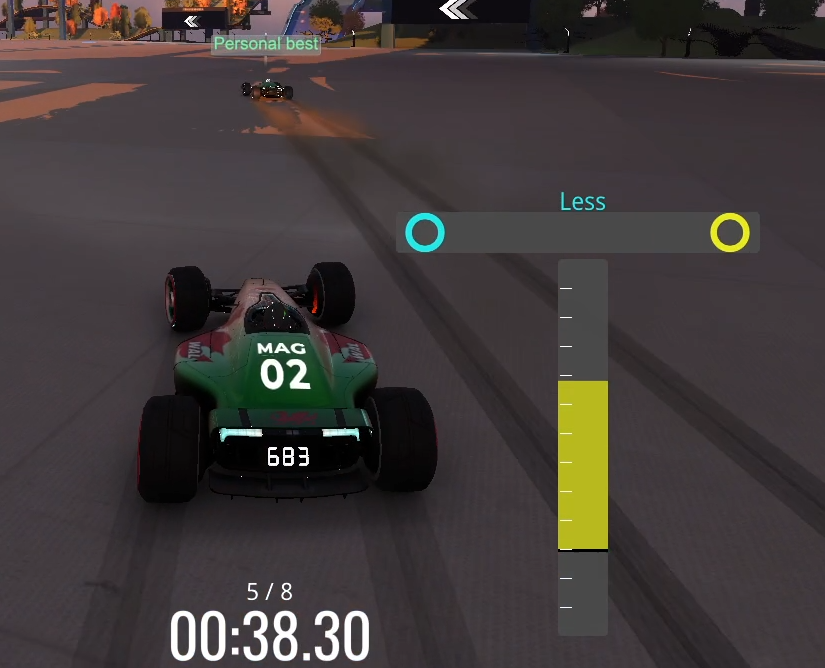
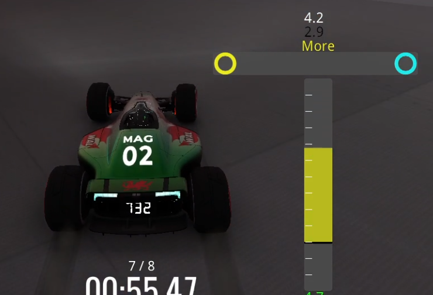

# Trackmania Speed Drift Trainer Plugin
 In-game plugin for Trackmania to visualise and coach speed drifts

## Features
* Customisable UI through settings
* Exact acceleration bar and display
* Speed Drift Steer coach bar to optimse speed drifts
* Speed Drift steer coach can have its sensitivity and text feedback adjusted
* Provides visual feedback for cam 3 players on fullspeed tracks

## Supported Surfaces
Currently: road, grass, plastic, dirt and metal (aka "platform") are all supported.

## Video Examples
https://youtu.be/k8vThB3wpHA

https://youtu.be/xHEoAxHk9x8

## How to setup
1. Download Openplanet (https://openplanet.dev/download)
2. Install the Speed Drift Plugin
3. Customise any UI or options. Press F3 -> Openplanet -> Settings -> Speed Drift Trainer -> change any settings as required.
Very good fs players may want to increase the steer coach drift sensitivity. Newer players may want to decrease this sensitivity.

## How it works
The speed drift trainer will calculate the current acceleration and drifting of the car relative to the surface.
Depending on your current speed, it will then calculate the optimal speed drift.
To visualise this, the acceleration bar and the speed drift coach bar will guide you.

## Case: no drift

If you are not currently in a drift, the plugin will automatically recognise this, grey out the steer coach bar and tell you to drift.
This is particularly helpful if you are playing in cam 3 and cannot see your wheels.

## Case: overdrifting

If you drift too much you won't accelerate at the maximum possible value.
This is shown in the vertical acceleration bar, which is yellow and shows only ~58% of the theoretical acceleration for the current speed.
The Steer coach bar informs that this is an overdrift in 2 ways:
1. It displays "Less" to tell the drive to steer less.
2. It shows 2 circles in the bar. The distance between the blue and yellow circle visually show how far away the current drift is from a perfect SD. In the screenshot, the car is overdrifting a lot and the circles are far from each other.
In the settings, you can also turn on the exact Raw Angular Acceleration if you want to see the raw numbers.

Remember: if the blue circle is on the left or the text "Less" appears, you are drifting too hard

## Case: underdrifting

If you don't drift enough you won't accelerate as fast as possible either.
Again, this is shown through a poor acceleration bar value and in the steer coach bar.
Now, the yellow circle is on the far left and the text appearing is "more". This shows the car is underdrifting and more steering is needed for the perfect SD.
Also in this screenshot, you can see the exact Raw Angular delta. 4.2 is the value needed for a perfect SD, but currently the car is only drifting at around 2.9

## Case: good drift

if your drift is near-optimal, you will see a white circle overlay onto the speed drift bar. When the yellow and blue circles perfectly overlap, your speed drift angle is optimal.
The acceleration bar also helps to visualise this by going green and displaying that you are close to the maximum possible acceleration for that speed.

## Limitations
1. The calculations are based on the frame tick-rate of your game (remember, the plugin can only execute each time the graphics load), so having a low framerate might affect the exact sensitivity and angle. The calculation is averaged over the last 4 frames of input, so any framerate above 40 should be reasonably accurate.
2. The plugin should work for all supported surfaces and road angles, however if the angle is rapidly changing (e.g. in a corkscrew) or your speed is otherwise erractic (e.g. reactor boost or large jump) then the exact angle may not be correct.
3. Unsupported surfaces, rapid surface changes and other physics (particularly icy wheels and wet wheels) may also throw off the plugin. In such cases, it may be best to simply disable the plugin for such a map.
4. I am not a good fullspeed driver and it's possible that my methodology did not fully maximise acceleration in testing. If you are regularly hitting or exceeding 100% acceleration (in the acceleration bar) then please get in touch so we can re-calibrate.

## Calculation details
For some velocity we take its cross product with the car's normal to its surface. This cross product is a vector which points exactly along the line the car is able to drift, without being affected by the slope or current trajectory of the car.
By noting the game's update rate we can calculate the rate by which this vector changes its angle. These angles are so small that the sin of this rate chance is the rate change, and in a case with a inf high framerate this would be true anyway through calculus. (In fact the angles are so small that attempting direct vector calculus gave me rounding errors in AngelScript.)
In the game's physics, the actual variable we are attempting to track is inversly proportionate to the max slide friction at that speed. This is the "magic value" which tells us the best speedslide angle.
Since this variable is hidden (so far as I can tell), we attempt to reverse-engineer it by using the slope of the speed - (inverse angle) graph from calibration exercises. The data on this is not perfect - my pearson coefficients were around 0.95. This is expected from human inputs.
We can then simply plug this back into the game's engine to calculate an optimal angle for any surface at any speed, and by comparing that optimal value against the current value being driven we can give feedback to the driver through the plugin.

## Feedback and support
The licence here gives anyone full use of the code if they wish to alter or improve it. I'm also happy to interact and receive suggestions or pull requests. You can also contact me on Discord (Magpie#6420)
For anyone looking to support - simply "starring" this repo in github helps a lot.